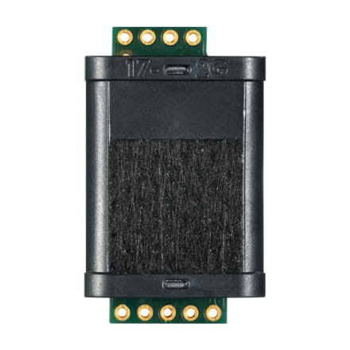
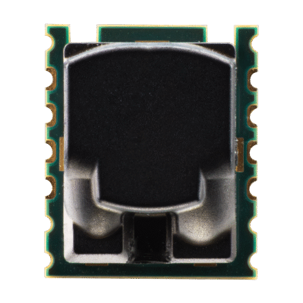
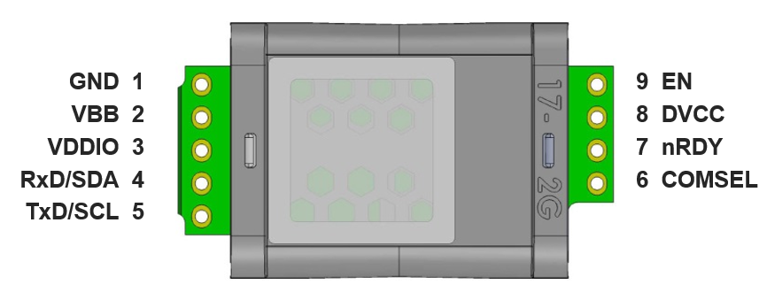
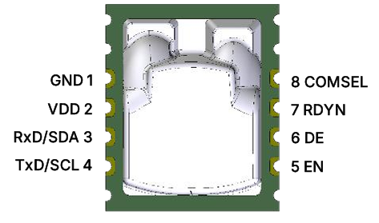
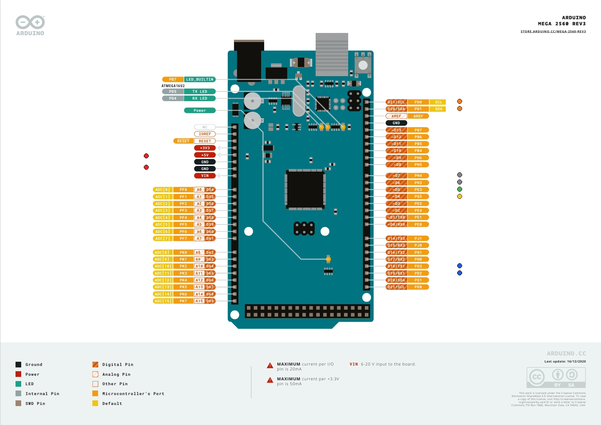
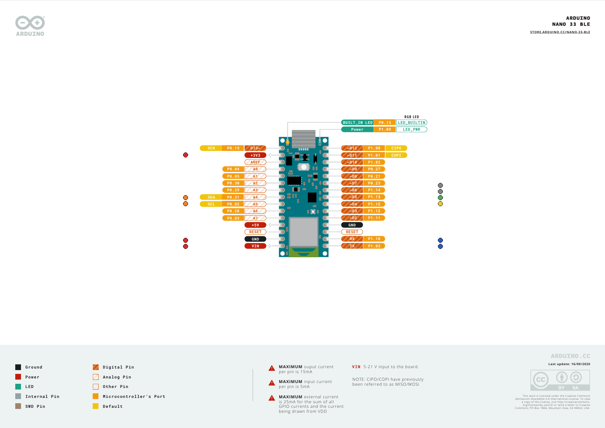

# Arduino library for the Sunrise, Sunlight and S12 sensor families

## Supported sensors

The library supports Sunrise/Sunlight and S12 CO2 sensors via I2C and Modbus RTU (UART):




| Feature | Sunrise / Sunlight | S12 |
|---------|--------------------|-----|
| I2C clock | up to 100 kHz | up to 400 kHz (Fast Mode) |
| Measurement period | 2 - 65534 s | 1 - 2047 s |
| Number of samples | 1 - 1024 | 1 - 999 (stepped) |
| I2C classes | `SunriseI2C` | `S12I2C` |
| Modbus classes | `SunriseModbus` | `S12Modbus` |

## Installation of the library

Install the library manually from a release `.zip`:

1. Download the latest release as a `.zip` file
2. Start the [Arduino IDE](http://www.arduino.cc/en/main/software)
3. Add the library via `Sketch` ➔ `Include Library` ➔ `Add .ZIP Library...` and select the downloaded file

Alternatively, clone or copy this repository into your Arduino `libraries/` folder.

## Connect the sensor
The sensors pin-out provided below:




Connect the sensor to your board according to the sensor specification or use one of the example connection diagram listed below

### Arduino boards connection

#### Arduino Mega

##### UART configuration

|Sunrise pin|S12 pin|Arduino pin|Color|Name|Note|
|-----------|-------|-----------|-----|----|----|
|1|1|GND|Red|Ground|Power supply|
|2|-|+5V|Red|VBB|Power supply|
|3|2|+5V|Red|VDDIO/VDD|IO power supply|
|4|3|D18|Blue|Sensor RxD signal|
|5|4|D19|Blue|Sensor TxD signal|
|6|8|-|-|COMSEL|Leave floating for UART|
|7|7|D7|-|nRDY/RDYN||
|8|-|-|-||Not used|
|9|5|D5|Green|Sensor enable|
|-|6|-|-||Not used|
|-|-|D6|Grey|Calibrate button|Optional, push-button to GND (INPUT_PULLUP)|

Note: the example sketches drive COMSEL from D4 (HIGH = Modbus, LOW = I2C) instead of using a fixed tie, so the same wiring can switch protocols at runtime.

##### I2C configuration

|Sunrise pin|S12 pin|Arduino pin|Color|Name|Note|
|-----------|-------|-----------|-----|----|----|
|1|1|GND|Red|Ground|Power supply|
|2|-|+5V|Red|VBB|Power supply|
|3|2|+5V|Red|VDDIO/VDD|IO power supply|
|4|3|D20|Orange|SDA signal|
|5|4|D21|Orange|SCL signal|
|6|8|GND|Red|COMSEL|Connect to GND for I2C|
|7|7|D7|-|nRDY/RDYN||
|8|-|-|-||Not used|
|9|5|D5|Green|Sensor enable|
|-|6|-|-||Not used|
|-|-|D6|Grey|Calibrate button|Optional, push-button to GND (INPUT_PULLUP)|

Note: the example sketches drive COMSEL from D4 (HIGH = Modbus, LOW = I2C) instead of using a fixed tie, so the same wiring can switch protocols at runtime.



Yellow marker = COMSEL (D4); grey marker = optional calibration button (D6).

#### Arduino Nano 33 BLE 

##### UART configuration

|Sunrise pin|S12 pin|Arduino pin|Color|Name|Note|
|-----------|-------|-----------|-----|----|----|
|1|1|GND|Red|Ground|Power supply|
|2|-|+3V3|Red|VBB|Power supply|
|3|2|+3V3|Red|VDDIO/VDD|IO power supply|
|4|3|TX|Blue|Sensor RxD signal|
|5|4|RX|Blue|Sensor TxD signal|
|6|8|-|-|COMSEL|Leave floating for UART|
|7|7|D7|-|nRDY/RDYN||
|8|-|-|-||Not used|
|9|5|D5|Green|Sensor enable|
|-|6|-|-||Not used|
|-|-|D6|Grey|Calibrate button|Optional, push-button to GND (INPUT_PULLUP)|

Note: the example sketches drive COMSEL from D4 (HIGH = Modbus, LOW = I2C) instead of using a fixed tie, so the same wiring can switch protocols at runtime.

##### I2C configuration

|Sunrise pin|S12 pin|Arduino pin|Color|Name|Note|
|-----------|-------|-----------|-----|----|----|
|1|1|GND|Red|Ground|Power supply|
|2|-|+3V3|Red|VBB|Power supply|
|3|2|+3V3|Red|VDDIO/VDD|IO power supply|
|4|3|A4|Orange|SDA signal|
|5|4|A5|Orange|SCL signal|
|6|8|GND|Red|COMSEL|Connect to GND for I2C|
|7|7|D7|-|nRDY/RDYN||
|8|-|-|-||Not used|
|9|5|D5|Green|Sensor enable|
|-|6|-|-||Not used|
|-|-|D6|Grey|Calibrate button|Optional, push-button to GND (INPUT_PULLUP)|

Note: the example sketches drive COMSEL from D4 (HIGH = Modbus, LOW = I2C) instead of using a fixed tie, so the same wiring can switch protocols at runtime.



Yellow marker = COMSEL (D4); grey marker = optional calibration button (D6).


## Quick Start

1. Install the libraries and dependencies according to [Installation of the library](#installation-of-the-library)

2. Connect the sensor to your Arduino as explained in [Connect the sensor](#connect-the-sensor)

3. Open one of a sample project within the Arduino IDE:

   `File` ➔ `Examples` ➔ `Senseair Sunrise`

4. Click the `Upload` button in the Arduino IDE or `Sketch` ➔ `Upload`

5. When the upload process has finished, open the `Serial Monitor` or `Serial Plotter` via the `Tools` menu to observe the measurement values. Note that the `Baud Rate` in the used tool has to be set to `115200 baud`.

## Examples

### Sunrise / Sunlight

| Example | Description |
|---------|-------------|
| `sunrise_continuous` | Continuous measurement mode (I2C or Modbus) |
| `sunrise_single` | Single measurement mode with host-managed power cycling |
| `sunrise_i2c_change_address` | Change sensor I2C address |
| `sunrise_modbus_change_address` | Change sensor Modbus address |
| `sunrise_scale_factor` | Show/change scale factors and continue measurement of scaled value |

### S12

| Example | Description |
|---------|-------------|
| `s12_continuous` | Continuous measurement mode (I2C or Modbus) |
| `s12_single` | Single measurement mode with host-managed power cycling |

Each example supports protocol selection via `#define SUNRISE_PROTOCOL_I2C` or `#define SUNRISE_PROTOCOL_MODBUS`, and optional Serial Plotter output via `#define SERIAL_PLOTTER_MODE`.

## API at a glance

Pick the class matching your sensor family and protocol; all share the same measurement and
configuration API inherited from `SunriseBase`.

| Class | Sensor | Protocol | Constructor (pins are optional) |
|-------|--------|----------|----------------------------------|
| `SunriseI2C`   | Sunrise/Sunlight | I2C        | `SunriseI2C(Wire, address, enablePin, nRdyPin)` |
| `SunriseModbus`| Sunrise/Sunlight | Modbus RTU | `SunriseModbus(&Serial1, address, enablePin, nRdyPin)` |
| `S12I2C`       | S12              | I2C        | `S12I2C(Wire, address, enablePin, nRdyPin)` |
| `S12Modbus`    | S12              | Modbus RTU | `S12Modbus(&Serial1, address, enablePin, nRdyPin)` |

Common methods (see `src/senseair_sunrise.h` for the full Doxygen-documented API):

| Area | Methods |
|------|---------|
| Lifecycle | `begin()`, `enable()`, `disable()`, `resetBySCR()` |
| Measurement | `readMeasurement()`, `initialSingleMeasurement()`, `readSingleMeasurement()`, `waitForReady()` |
| Base config | `get/setSensorConfig()`, `setMeasurementMode()`, `get/setABCPeriod()` |
| Extended config | `get/setSensorExtendedConfig()`, `enable/disableABC()`, `enable/disableIIRFilters()`, `enable/disablePressureComp()`, `enable/disableNRDY()` |
| Calibration | `sendCalibrationCommand()`, `getCalibrationStatus()`, `setCalibrationTarget()`, `setPressureValue()` |
| Identification | `getFirmwareType()`, `getFirmwareRevision()`, `getSensorSerialNumber()`, `getSensorID()` (Modbus) |
| Scaling (Sunrise, FW 4.10+) | `get/setScaleFactor()`, `getScaledMeasurement()` |
| Addressing | `setSensorAddress()`, `setCommAddress()` |
| Diagnostics | `SunriseBase::evaluateError(error, action)` |

Every call returns a `SunriseError` (`NO_ERROR` on success). A successful `readMeasurement()` still
requires checking `SunriseMeasurement::errorStatus` against the `ErrorStatus` flags to confirm the
reading is valid.

## Recommendations

1. In "Single" measurement mode, if the measurement period exceeds 60 seconds, disable filters to improve sensor response time.
2. In "Single" measurement mode, if the measurement period exceeds 60 seconds, increase the number of samples to reduce noise, provided the power consumption budget allows it.

### Building with arduino-cli

Install support for Arduino Nano 33 BLE:

`arduino-cli core install arduino:mbed_nano`

Compile an example:

`arduino-cli compile --libraries ../ --fqbn arduino:mbed_nano:nano33ble ./examples/sunrise_continuous`

## Automated Example Testing

This repository includes a small helper script to compile, upload, and verify Arduino example sketches on connected boards.

Usage:

```bash
python scripts/test_connected_boards.py --example examples/sunrise_single
```

To list connected boards:

```bash
python scripts/test_connected_boards.py --list
```

If you need to target a specific board or port, add `--fqbn` and/or `--port`.

## License

See [LICENSE](LICENSE).